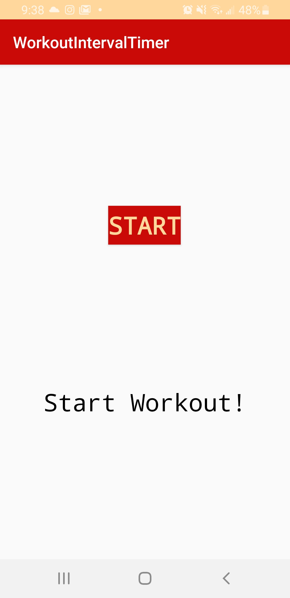
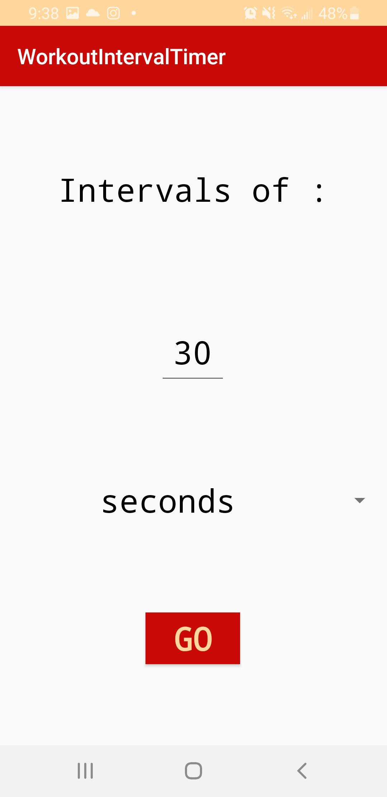
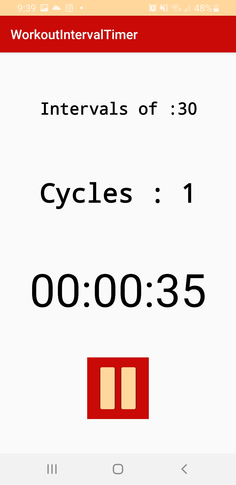

# WorkoutIntervalTimerApp

This is an app that counts timed intervals (depending on user's time preference).  
It allows you to select how long you want the intervals to be, and everytime it hits the selected time,
it notifies you and adds on to the number of cycles elapsed.  
This app was made with the purpose to aid physical training with time.

First Event:
This is the welcome page, go ahead and click start.

Second Event:
This is the intervals page.  Select desired intervals in seconds or minutes.

Final Event:
Now you have a timer set up that will notify you everytime the interval occurs and will keep track of the number of cycles.

Hit the back button to create a new timer!
